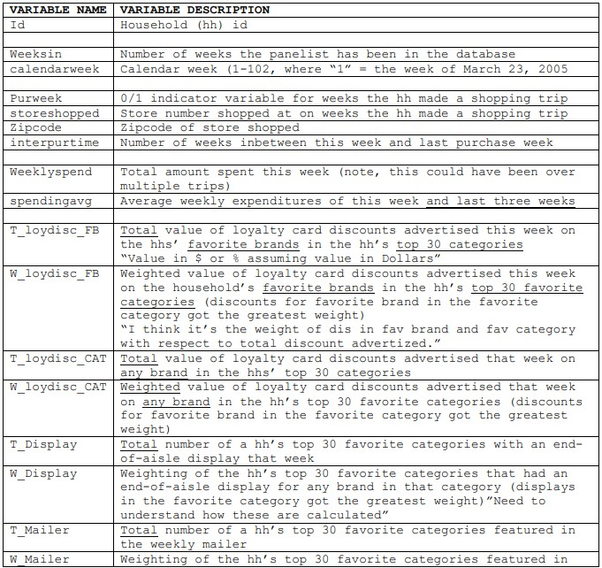
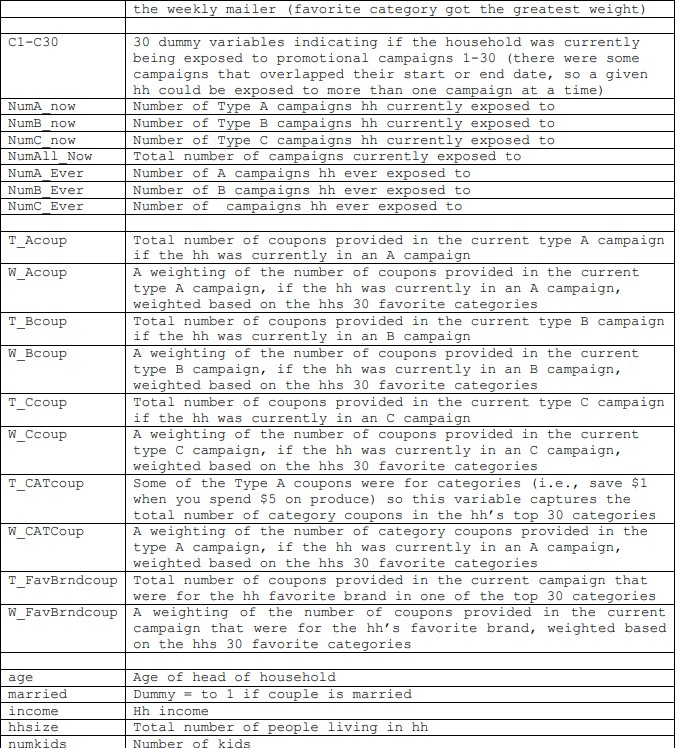
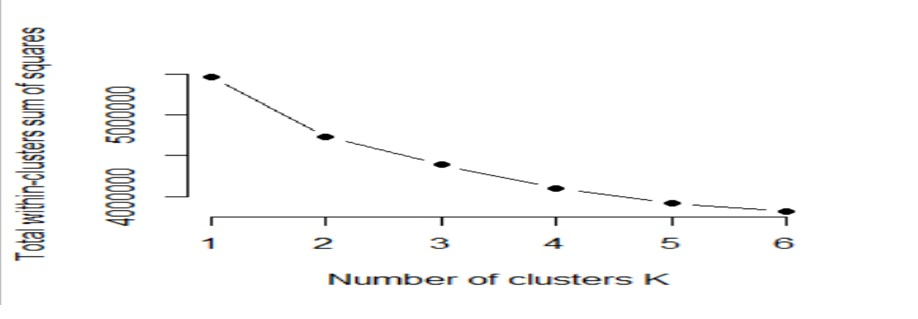
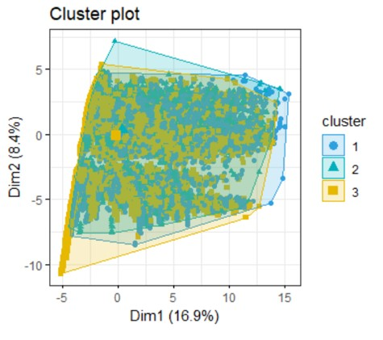
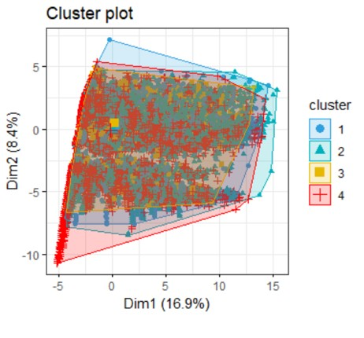
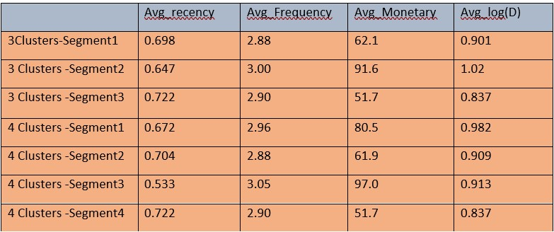
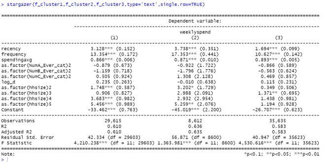
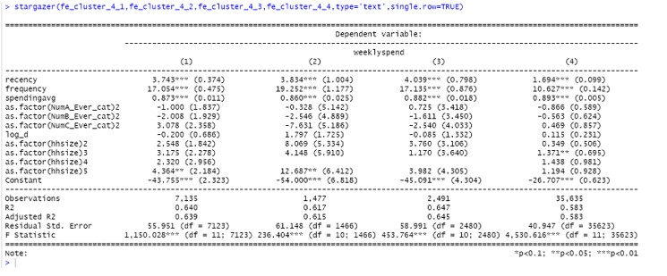

More and more retailers are using loyalty card data to track every purchase made by the households that buy from them.  This data can then be used to develop customized promotional campaigns targeted at specific households to grow those households’ spending and share of wallet with the firm over time.  Despite the widespread use of such customized and targeted marketing efforts and the costs of implementing them compared to mass promotional activities, it is surprising that little is known about the impact of a more vs. less customized targeted retailer promotion schedule or the ideal schedule of targeted retailer promotions, on household spending and share-of-wallet over time.

# RFMD analysis

## Problem Statement
More and more retailers are using loyalty card data to track every purchase made by the households that buy from them.  This data can then be used to develop customized promotional campaigns targeted at specific households to grow those households’ spending and share of wallet with the firm over time.  Despite the widespread use of such customized and targeted marketing efforts and the costs of implementing them compared to mass promotional activities, it is surprising that little is known about the impact of a more vs. less customized targeted retailer promotion schedule or the ideal schedule of targeted retailer promotions, on household spending and share-of-wallet over time.

 Predict the effectiveness of different campaigns and spending patterns for households.

**Analysis**

1) The issue bargains upon the retail analytics and we are inquired to unravel them utilizing RFMD analysis. The issue comes up with three sorts of campaigns sending coupons to each family units in case they are appearing any impact on the family’s acquiring behavior. Identify the components that might help in decreasing the recency of every family. Our concern is to analyze if there's any impact of the campaign and report it to the store manager.
2) We can observe customer behavior and learn from it. We have a variety of independent factors such as age, marital status, and income. We can predict their consequences and plan accordingly.
3) Customer loyalty can be established because we prefer to focus and market based on the information obtained from customers.
Promotions can be tailored to the preferences of customers. We can classify households and plan successful marketing efforts.


## Dataset

Veteran's Administration Lung Cancer Trial 137 patients with advanced, inoperable lung cancer were treated with chemotherapy (standard) or chemotherapy combined with a new drug (test).


**Data Dictionary**





## Analysis

# Part 2. Exploring K-type of Heterogeneity




The value of k at the "elbow," or the point where distortion/inertia starts to fall linearly, must be determined to establish the appropriate number of clusters. As a result, we find that 4 clusters are better when compared to 3 clusters.

## part 3. K_MEANS SEGMENTATION WITH THREE CLUSTERS:



## part 4. K_MEANS SEGMENTATION WITH FOUR CLUSTERS:



## CLUSTER ANALYSIS:

# SUMMARIZING VALUES IN A TABLE FOR EACH CATEGORY IN EACH SEGMENT





3Clusters-Segment 3 has least d and monetary values.
3Clusters -Segment 1 has highest recency values.
3Clusters -Segment2 has highest frequency, D and monetary values.
4Clusters- Segment1 has highest D value. 
4Clusters - Segment3 has highest frequency and monetary value.
4Clusters -Segment4 has highest  recency value


**Code Snippet for Stargazer**

```
#Stargazer
f_cluster1=lm(weeklyspend ~ recency+frequency+spendingavg+as.factor(NumA_Ever_cat)+as.factor(NumB_Ever_cat)+as.factor(NumC_Ever_cat)+log_d+as.factor(hhsize),data=cluster1)

f_cluster2=lm(weeklyspend ~ recency+frequency+spendingavg+as.factor(NumA_Ever_cat)+as.factor(NumB_Ever_cat)+as.factor(NumC_Ever_cat)+log_d+as.factor(hhsize),data=cluster2)

f_cluster3=lm(weeklyspend ~ recency+frequency+spendingavg+as.factor(NumA_Ever_cat)+as.factor(NumB_Ever_cat)+as.factor(NumC_Ever_cat)+log_d+as.factor(hhsize),data=cluster3)

```


**STARGAZER OUTPUT FOR ALL THE THREE MODELS:**



## APPLYING FIXED EFFECTS TO ALL THE 3 SEGMENTS CLUSTER:

**Code Snippet for Stargazer**

```

f_cluster_4_1=lm(weeklyspend ~ recency+frequency+spendingavg+as.factor(NumA_Ever_cat)+as.factor(NumB_Ever_cat)+as.factor(NumC_Ever_cat)+log_d+as.factor(hhsize),data=clusters_4_1)
f_cluster_4_2=lm(weeklyspend ~ recency+frequency+spendingavg+as.factor(NumA_Ever_cat)+as.factor(NumB_Ever_cat)+as.factor(NumC_Ever_cat)+log_d+as.factor(hhsize),data=clusters_4_2)
f_cluster_4_3=lm(weeklyspend ~ recency+frequency+spendingavg+as.factor(NumA_Ever_cat)+as.factor(NumB_Ever_cat)+as.factor(NumC_Ever_cat)+log_d+as.factor(hhsize),data=clusters_4_3)
f_cluster_4_4=lm(weeklyspend ~ recency+frequency+spendingavg+as.factor(NumA_Ever_cat)+as.factor(NumB_Ever_cat)+as.factor(NumC_Ever_cat)+log_d +as.factor(hhsize),data=clusters_4_4)

```

## STARGAZER OUTPUT FOR ALL THE FOUR MODELS:



# Explaining the response of a best model: including  Fixed Effect and  K-means+Fixed Effects and showing the the pros and cons of segmentation from both a managerial and IT perspective.


# From the AIC values we can say that custer_4_2  which is 16355.2 having the Least AIC value.

## Conclusion

I prefer the Kmeans + Fixed Effects model since it allows us to categorize and examine the effects based on AIC values. From a commercial standpoint, deciding promotions and designing marketing campaigns based on segmentation will be simple. People who are specifically targeted would be more particular.

However, segmentation has a few drawbacks. If we mindlessly follow the results, we may miss a group of households. Household habits may alter in the actual world, and the data we have may not be completely accurate. So, to some extent, we should use these segmented models and make business decisions based on domain knowledge.

To figure out which campaigns are more successful. I utilized glm regressions OLS models, but because the data is multi-leveled and the independence test is frequently broken, our interpretation is skewed. We employed multilayer modeling for these reasons.By looking at the m7 output. We can get greater weekly spending if we run more A campaigns for clients.


